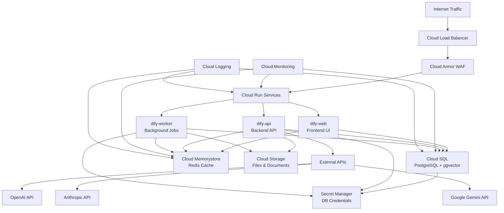

# 🏗️ ארכיטקטורת Dify.ai על GCP

## תרשים תלות משאבים



## מפרט משאבים

### Cloud Run Services
- **dify-web**: Frontend UI (React/Next.js)
  - CPU: 1 vCPU
  - Memory: 1 GB
  - Min instances: 0
  - Max instances: 10
  
- **dify-api**: Backend API Server  
  - CPU: 2 vCPU
  - Memory: 4 GB
  - Min instances: 1
  - Max instances: 20
  
- **dify-worker**: Background Processing
  - CPU: 2 vCPU
  - Memory: 2 GB
  - Min instances: 1
  - Max instances: 5

### Cloud SQL (PostgreSQL)
- **Instance**: db-f1-micro (Development) / db-custom-2-8192 (Production)
- **Storage**: 20GB SSD (auto-resize enabled)
- **Extensions**: pgvector for embeddings
- **Backups**: Daily automated backups
- **High Availability**: Multi-zone (Production)

### Cloud Memorystore (Redis)
- **Tier**: Basic (Development) / Standard (Production)  
- **Memory**: 1 GB (Development) / 5 GB (Production)
- **Version**: Redis 7.0
- **Network**: VPC peering

### Cloud Storage
- **Bucket**: dify-storage-{project-id}
- **Location**: us-east1 (same as compute)
- **Storage Class**: Standard
- **Versioning**: Enabled
- **Lifecycle**: Delete after 90 days for temp files

### Networking
- **VPC**: Custom VPC with private subnets
- **VPC Connector**: For Cloud Run to VPC communication
- **Cloud NAT**: For outbound internet from private resources

## משתני סביבה קריטיים

### אבטחה
```env
SECRET_KEY=<Generated 42-char key>
INIT_PASSWORD=<Admin password>
CONSOLE_WEB_URL=https://your-domain.com
CONSOLE_API_URL=https://api.your-domain.com
```

### מסד נתונים
```env
DB_USERNAME=dify_user
DB_PASSWORD=<From Secret Manager>
DB_HOST=<Cloud SQL Private IP>
DB_PORT=5432
DB_DATABASE=dify
```

### Cache
```env
REDIS_HOST=<Memorystore IP>
REDIS_PORT=6379
REDIS_PASSWORD=<From Secret Manager>
CELERY_BROKER_URL=redis://:<password>@<host>:6379/1
```

### אחסון
```env
STORAGE_TYPE=google-storage
GOOGLE_STORAGE_BUCKET_NAME=dify-storage-lionspace
```

### AI Models
```env
# OpenAI
OPENAI_API_KEY=<From Secret Manager>

# Anthropic  
ANTHROPIC_API_KEY=<From Secret Manager>

# Google Gemini
GOOGLE_API_KEY=<From Secret Manager>
GOOGLE_VERTEX_PROJECT=lionspace
GOOGLE_VERTEX_LOCATION=us-east1
```

## אבטחה והרשאות

### Service Account
```yaml
name: dify-service-account@lionspace.iam.gserviceaccount.com
roles:
  - roles/cloudsql.client
  - roles/storage.objectAdmin  
  - roles/secretmanager.secretAccessor
  - roles/redis.editor
  - roles/aiplatform.user
```

### Secret Manager Secrets
- `dify-secret-key`: Application secret key
- `dify-db-password`: Database password
- `dify-redis-password`: Redis password  
- `openai-api-key`: OpenAI API key
- `anthropic-api-key`: Anthropic API key
- `google-ai-api-key`: Google AI API key

## ניטור ולוגים

### Cloud Monitoring Metrics
- Request latency (P50, P95, P99)
- Request count and error rate
- CPU and memory utilization
- Database connections
- Redis hit rate

### Health Checks
- `/health` endpoint על כל שירות
- Database connectivity check
- Redis connectivity check
- External API availability

### Alerts
- High error rate (>5%)
- High latency (P95 >2s)  
- High CPU utilization (>80%)
- Database connection errors
- Redis connection errors

## הערכת עלויות (חודשית)

### Development Environment
- Cloud Run: ~$20
- Cloud SQL: ~$25
- Memorystore: ~$15
- Storage: ~$5
- **Total: ~$65/month**

### Production Environment  
- Cloud Run: ~$100
- Cloud SQL: ~$150
- Memorystore: ~$75
- Storage: ~$20
- Load Balancer: ~$25
- **Total: ~$370/month**

*הערה: עלויות משתנות בהתאם לשימוש בפועל*